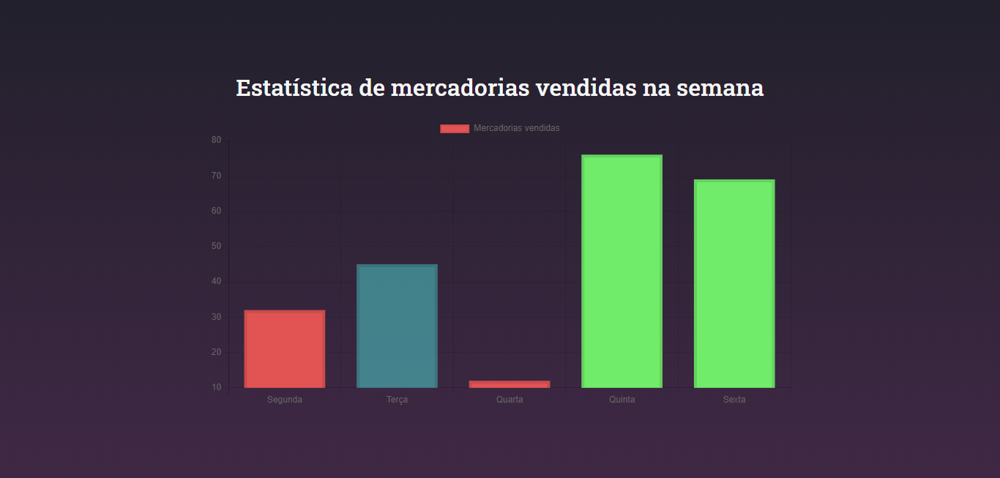

  <a href="#metro-tecnologias">Tecnologias</a>&nbsp;&nbsp;&nbsp;|&nbsp;&nbsp;&nbsp;
  <a href="#-projeto">Projeto</a>&nbsp;&nbsp;&nbsp;|&nbsp;&nbsp;&nbsp;
  <a href="#fire-dependências">Dependências</a>&nbsp;&nbsp;&nbsp;|&nbsp;&nbsp;&nbsp;
  <a href="#key-como-inicializar">Como inicializar?</a>&nbsp;&nbsp;&nbsp;&nbsp;&nbsp;&nbsp;

 

  

## :metro: Tecnologias

Esse projeto foi desenvolvido com as seguintes tecnologias:

- [ReactJS](https://reactjs.org)
- [Typescript](https://www.typescriptlang.org/docs/home.html)

## 💻 Projeto

Demo desenvolvida para testar bibliotecas de gráficos no ReactJS.

## :fire: Dependências

Para instalar as dependências de pacotes basta:

- npm install ou yarn

## :key: Como inicializar?

Para inicilizar em ambiente local deve-se seguir os passos abaixo:

- npm run start ou yarn start para inicializar